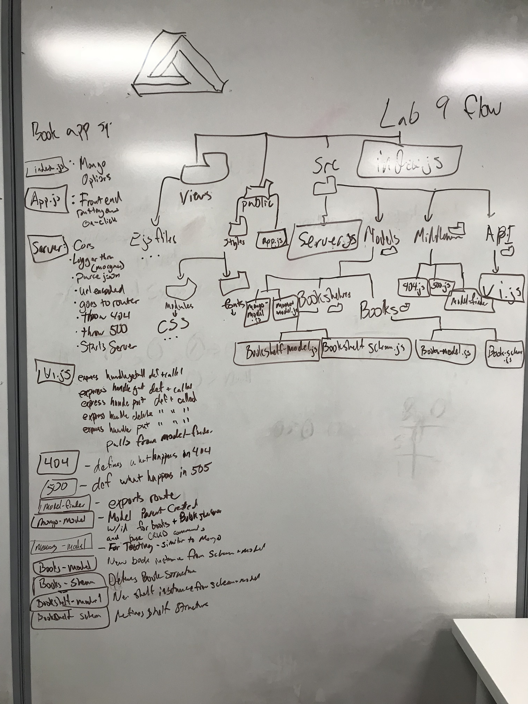
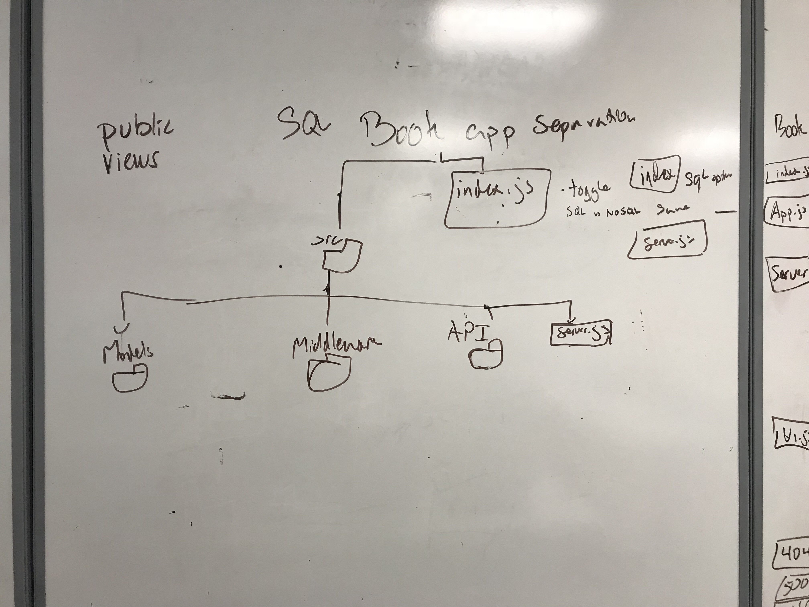

 LAB
=================================================

## Book App v2

### Author: Aaron Ferris, Spencher Hirata & Jon Gentry

### Links and Resources
* [Pull Request](https://github.com/codefellows-js-401d29-aaron-ferris/Lab-BookApp-V2/pull/2)
* [travis](http://xyz.com) not setup
* [front-end](http://xyz.com) (I do not have the link to heroku)

#### Documentation
* [swagger](http://xyz.com) (extension will be posted when heroku is made)
* [jsdoc](http://xyz.com) (extension will be posted when heroku is made)

### Modules
#### `Server.js`
 * This module calls all of the separat e modules that have been used to define the app.
 * exports the information.
 * Sets up the jsdocs.
 * sets up the ejs files to render.
 * Starts the app listening.

#### `run.js`
##### Exported Values and Methods
 * This module calls all of the separat e modules that have been used to define the app.
 * exports the information.
 * Sets up the jsdocs.
 * sets up the ejs files to render.
 * Starts the app listening.
 
###### `start`
starts up the app

#### `app.js`
##### Exported Values and Methods
 * Handles the hide function server side for the form 

#### `mongo.js`
##### Exported Values and Methods
* Handles the mongo routes
 * Exports all of the methods used in the module
###### `getBooks`
 * Handles the get route for books.
 * Takes in parameters request resonse next.
 * renders the new page if the book is found, otherwise renders the index
###### `createSearch
 * Handles the search from the google books api, giving us the information to store in our own api.
 * Takes in parameters request and response
##### `newSearch`
 * Handles the rendering of a new page upon a search
 * uses response
##### `getBook`
* Handles the get method from our own saved database to retrieve a particular book.
 * Takes in request and response. Imports getBookshelves. Renders the show page
##### `getBookshelves`
 * Handles the get method from our own saved database to retrieve the bookshelves so we may look through them to apply to the particular book .
 * exported to getBook
##### `createShelf`
 * Handles the post method for bookshelves to our own saved database to create bookshelves for the user if the bookshelf does not already exist
##### `createBook`
 * Handles the post method to our own saved database to save books for the user.
 * Has the crewteshelf if the shelf specified does not already exist
 * renders individual book page when done
##### `updateBook`
 * Handles the put method for books. Used to update book information for the user should it be wrong.
 * Renders specific book shen its done
##### `deleteBook`
 * Handles the delete method to our own saved database to delete saved books for the user
 * renders home page when run
##### `handleError`
 * Handles the error running it whenever there is an issue

#### `pg.js`
 * Handles the PSQL routes
 * Exports all of the methods used in the module
##### Exported Values and Methods
 * Handles get for the books in our database.
 * Takes request and response. 
 * Outputs all books and renders them to index, or renders new if there are no books.
###### `getBooks`
 * Handles get for the books in our database.
 * Takes request and response. 
 * Outputs all books and renders them to index, or renders new if there are no books.
###### `createSearch`
 * Handles call to google books api.
 * Takes request and response. 
 * Outputs all from search query and renders to show page.

###### `newSearch
 * Handles retrieval of an individual of our books in our database.
 * Calls the bookshelves.
 * Renders on the show page
###### `getBook`
 * Handles retrieval of an individual of our books in our database.
 * Calls the bookshelves.
 * Renders on the show page###### `getBookshelf
 * Retrieves all bookshelves. Used in getBook
###### `createShelf`
 * Handles what happenes if a shelf doesnt exist. usually used when a new book is created
###### `createBook`
 * Handles post for a new book in PSQL. Utilizes createbooks
 * Inputs of request and resonse
 * renders output book o individual ID page
###### `updateBook`
* Handles put request for a book
 * takes input of request and response
 * renders onto individual book page
###### `deleteBook`
 * Handles delete method for PSQL
 * renders on error pages

#### `500.js`
 * this module is used render the page when another page throws an error
 * renders error page
##### Exported Values and Methods

###### `handleError`
* handles errors and renders it to error page

#### `books-model.js`
##### Exported Values and Methods
 * Creats the book class extended for mongo-model, and uses books shcema to define it

#### `books-schema.js`
##### Exported Values and Methods
 * this defines the shape of the books object for mongo. adds the bookshelf appropriate from the bookshelves object to the book capablities of every class created for the model used for each of the models
###### `books=mongoose.schema`
 * defines base book object

###### `books.virtual`
 * adds bookshelf to it

#### `books.js`
##### Exported Values and Methods
 * defines the structre of the books class in pg

#### `bookshelf-model.js`
##### Exported Values and Methods
 * Creats the bookshelf class extended for mongo-model, and uses bookshelf shcema to define it

#### `bookshelf-schema.js`
##### Exported Values and Methods
 * Creats the is uesd to define the bookshelf class with an id of  the bookshelf's name

#### `mongo-model.js`
##### Exported Values and Methods
 * this defines the CRUD capablities of every class created for the model used for each of the models
###### `get`
* get method that calls by ID
###### `post`
* post method that calls by ID
###### `put`
* put method that calls by ID
###### `delete`
* delete method that calls by ID

#### `memory-model.js`
 * This modlue normalizes the model, and creates require model for appropriate model where needed

### Setup
#### `.env` requirements
* `PORT` - port defined in .env and pulled from there. Usually uses
* `MONGODB_URI` - URL to the running mongo instance/db
* uses scripts. Install them with `npm i __`
  * mongo
  * mongod
  * pg
  * express
  * superagent
  * methodOverride
  * mongoose
  * ejs

#### Running the app
* Should come up on the initial server when loaded through.
* Get routes can be accessed throug initial page.
  
#### Tests
* Unsure how tests are (for spencer to input)

#### UML

